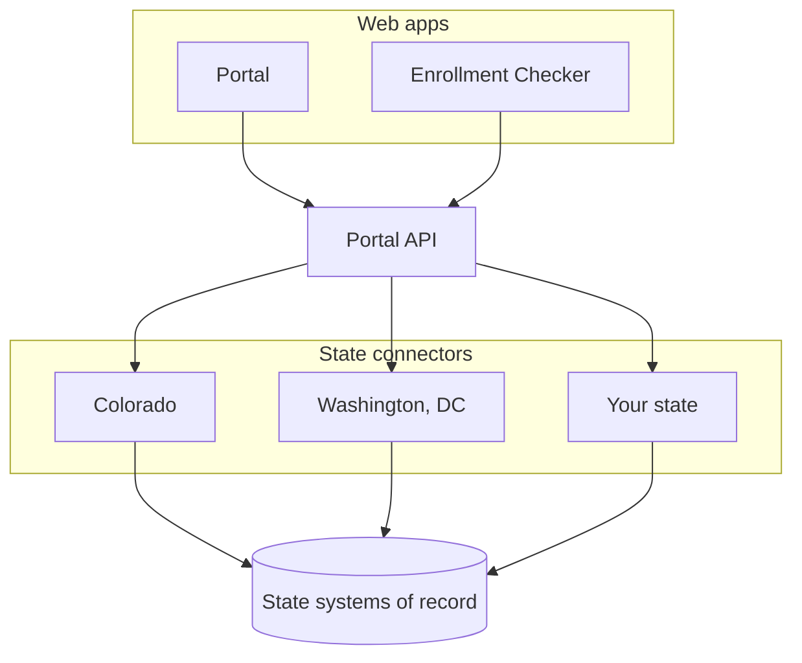

# Summer EBT Self-Service Portal

Give families a way to manage their Summer EBT benefits, in their own language, on the platform your state already
runs. In use today by Colorado and Washington, DC.

<ul class="intro-capabilities">
  <li>Check enrollment, no account</li>
  <li>See benefits and card status</li>
  <li>Activate or replace a card</li>
  <li>Update an address</li>
</ul>

  <a class="cta" href="https://github.com/codeforamerica/sebt-self-service-portal#local-environment-set-up">
    
    Set up your environment
    Install, run, and test the portal locally.
  </a>
  <a class="cta" href="guides/state-connector/index.md">
    
    Add a new state
    Build a connector to your state's systems of record.
  </a>
  <a class="cta" href="guides/content/index.md">
    
    Change what families see
    Update wording in any supported language.
  </a>
  <a class="cta" href="compliance/index.md">
    
    Review compliance
    Licensing, accessibility, security, and identity proofing.
  </a>

## How the pieces fit

Everything state-specific lives in the bottom lane. The API above it knows only the interfaces, so a new state is a
new connector rather than a change to the portal.

## More

- [Architecture Decisions](adr/index.md) explain why the system is shaped the way it is.
- [.NET API Reference](api/index.md) covers every published C# type.
- [Releases](releases.md) tell you what changed and when.
- [Repository README](https://github.com/codeforamerica/sebt-self-service-portal#readme) holds installation, local
  development, and database setup.
