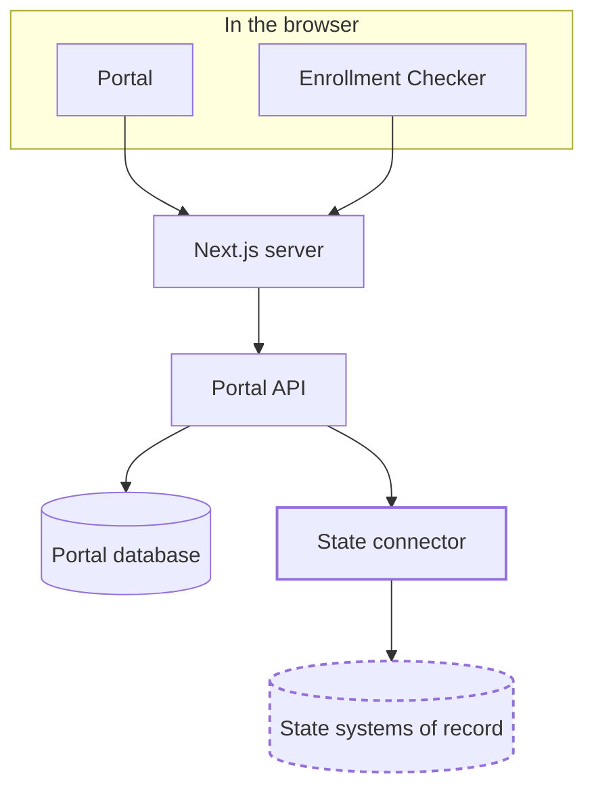

# How it works

Families see one website. Behind it, the application is the same in every state, and everything a state does
differently sits behind a single interface. That is the whole design in a sentence, and the rest of this page is what
it means in practice: how a request travels, what the portal keeps, and which decisions are yours to make.

This page describes the system as it runs. For the code itself, namespace by namespace, see the
[.NET API Reference](../../api/index.md).

## The shape

Color marks who owns each piece:

- **Blue** is the shared application. Identical in every state, and you adopt it rather than build it.
- **Gold** is the connector. The one component written per state, against a published contract.
- **Dashed grey** is the state's own systems. Outside the portal entirely, and the portal reads far more from them
  than it writes.

The connector is the only component that knows anything about a particular state. That is why adding a state is a new
connector rather than a change to the portal, and why the blue boxes look the same in Denver and in Washington.

## What happens when a family signs in

The browser never calls the .NET API directly. Every request to `/api/...` goes to the Next.js server first, through a
catch-all route that forwards it on. That route is the single server-side point every API call passes through, and it
exists for reasons worth stating plainly:

- **Credentials stay on the server.** The OIDC token exchange happens in .NET, so the `code_verifier` and the client
  secret are never sent to a browser.
- **The backend is not addressable from outside.** The proxy rejects path traversal, literal or URL-encoded, so a
  crafted request cannot escape `/api/` and reach the API's own `/health` or `/swagger`.
- **Failures are legible.** A timeout becomes a 504 and an unreachable backend becomes a 502, both recorded on a
  trace span rather than surfacing as an opaque error.

From there the API resolves the connector for the configured state, asks it for the household, and the connector
translates whatever the state's systems return into the portal's canonical model. The household never reaches the
portal's database. It is read for the request and discarded.

## What the portal stores, and what it doesn't

The portal's own database has six tables. This is all of them:

| Table                        | What it holds                                                                                                                                                     |
| ---------------------------- | ----------------------------------------------------------------------------------------------------------------------------------------------------------------- |
| `Users`                      | The identity assurance level a user has reached.                                                                                                                  |
| `UserOptIns`                 | Whether the user agreed to store their email address or date of birth. Storing either is opt-in, not the default.                                                 |
| `DocVerificationChallenges`  | Individual document verification attempts, each with its own lifecycle.                                                                                           |
| `EnrollmentCheckSubmissions` | When a check ran, how many children it covered, and a hash of the IP address.                                                                                     |
| `DeidentifiedChildResults`   | Per child: birth year, status, eligibility type, school name. No name, and no full date of birth.                                                                 |
| `CardReplacementRequests`    | Cooldown enforcement. Household and case identifiers are stored as HMAC-SHA256 hashes, because only lookup is needed and the original values are never read back. |

What is deliberately absent matters as much as what is present. Children's names, case numbers, benefit amounts, card
numbers, and mailing addresses have no table here. They are read from the state's systems for the request that needs
them and are not written down. Where an identifier has to persist for a business rule, such as enforcing a card
replacement cooldown, it is stored as a one-way hash rather than in the clear.

## The connector boundary

A connector is a set of services the portal discovers at runtime. Reads are the default; writes are limited to three
well-known operations, so adopting the portal does not mean granting broad write access to a system of record.

| Service                                                                 | What the state supplies                                                                             |
| ----------------------------------------------------------------------- | --------------------------------------------------------------------------------------------------- |
| <xref:SEBT.Portal.StatesPlugins.Interfaces.ISummerEbtCaseService>       | Household lookup by identifier. The main read path.                                                 |
| <xref:SEBT.Portal.StatesPlugins.Interfaces.IEnrollmentCheckService>     | Enrollment matching for the unauthenticated check.                                                  |
| <xref:SEBT.Portal.StatesPlugins.Interfaces.IAddressUpdateService>       | Writes a mailing address change to the system of record.                                            |
| <xref:SEBT.Portal.StatesPlugins.Interfaces.ICardReplacementService>     | Dispatches a replacement card request and updates whatever cooldown the state tracks.               |
| <xref:SEBT.Portal.StatesPlugins.Interfaces.IStateMetadataService>       | State metadata the portal displays.                                                                 |
| <xref:SEBT.Portal.StatesPlugins.Interfaces.IStateHealthCheckService>    | Health checks for the state's own external dependencies, registered into the API's health endpoint. |
| <xref:SEBT.Portal.StatesPlugins.Interfaces.IStateAuthenticationService> | Swagger security options matching the state's authentication scheme.                                |

The contract is documented in full in [Build a state connector](../state-connector/index.md).

## The choices a state makes

Colorado and DC run the same application and agree on almost none of these. Each row is a real decision point, with
both answers in production today.

| Decision                             | CO                                                                             | DC                                                                   |
| ------------------------------------ | ------------------------------------------------------------------------------ | -------------------------------------------------------------------- |
| **How household data is read**       | A live API call, querying CBMS on each request.                                | A state-provided database, `DcSource`, seeded on a schedule.         |
| **Who performs identity proofing**   | The state's own SSO does it, and asserts an assurance level the portal trusts. | The portal does it, calling Socure directly.                         |
| **Where the connector lives**        | In this repository, alongside the portal, at `apps/connectors/co`.             | In the state's own repository, built against the published contract. |
| **How it is deployed**               | Containers on AWS ECS.                                                         | IIS on Windows Server.                                               |
| **How the enrollment checker ships** | The Next.js application in this repository.                                    | A separate application the state already runs.                       |

The identity proofing row is the one that surprises people. Colorado's SSO happens to use the same vendor DC calls
directly, but the portal never talks to it in Colorado. It reads the assurance level from the sign-in and takes it as
given. Whether the portal owns proofing or consumes it is a state's decision, not a property of the software.

## What varies, and what does not

| Surface                  | Varies how                                                                     |
| ------------------------ | ------------------------------------------------------------------------------ |
| Household data access    | The connector. Everything state-specific about reading and writing lives here. |
| Wording and translations | Per-state content, generated into locale files rather than hardcoded.          |
| Color, type, and logo    | Per-state design tokens.                                                       |
| Which features are on    | A per-state configuration overlay and feature flags.                           |
| Everything else          | Shared. One codebase, one API, one set of components.                          |

## Where to go next

- [Build a state connector](../state-connector/index.md) walks through implementing the contract above.
- [Change user-facing text](../content/index.md) covers the content and translation pipeline.
- [Set up your development environment](../local-setup/index.md) gets the whole stack running locally.
- [Architecture Decisions](../../adr/index.md) record why these choices were made, including
  [the multi-state plugin approach](../../adr/0023-multi-state-plugin-approach.md) and
  [clean architecture](../../adr/0002-adopt-clean-architecture.md).
