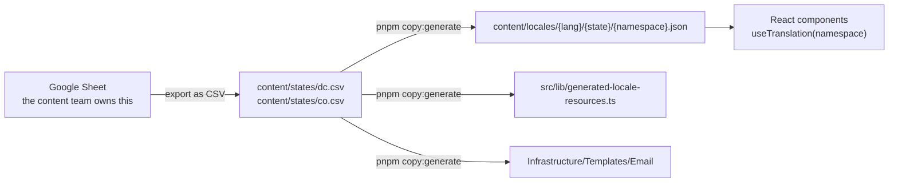

# Change user-facing text

Every word that a family reads comes from a content pipeline, not from the source code of a component. A Google
Sheet holds the text. A generator converts it into JSON files. The React apps read those JSON files through
i18next.

This guide tells you how to add text, how to change text, and how to repair a key that does not appear.

## The pipeline

> [!WARNING]
> Never edit a file under `content/locales/`. The generator overwrites every one of those files. The commands
> `pnpm dev`, `pnpm build`, and `pnpm test` all run the generator first, so your change disappears at the next
> command. Edit the CSV instead.

## Authored files and generated files

| Path | Who writes it |
| --- | --- |
| The Google Sheet | The content team |
| `packages/design-system/content/states/{state}.csv` | Exported from the Sheet |
| `content/locales/{lang}/{state}/{namespace}.json` | The generator |
| `src/lib/generated-locale-resources.ts` | The generator |
| `apps/portal/src/SEBT.Portal.Infrastructure/Templates/Email/` | The generator |

The CSV files are the version-controlled source. The Sheet is the editorial source. Keep them in step.

## Scale of the current content

| Item | Value |
| --- | --- |
| Languages | 3: English, Spanish, Amharic |
| States | 2: DC and CO |
| Namespaces for DC | 22 |
| Apps that consume the content | 2: the Portal and the Enrollment Checker |

## Where to start

| Your task | Read |
| --- | --- |
| Add a new string, or change an existing one | [Add or change a key](add-a-key.md) |
| Repair a key that shows no text | [Troubleshooting](troubleshooting.md) |

## The two apps generate different content

Each app runs the generator with its own arguments. The Enrollment Checker takes a subset of the sections.

| App | Generator arguments |
| --- | --- |
| Portal | `--app portal` |
| Enrollment Checker | `--app enrollment --sections S1,GLOBAL,S10,S9,DEV,S11` |

[ADR 0009](../../adr/0009-locale-section-filtering.md) gives the reason for the section filter. A string that you
add for the Portal does not reach the Enrollment Checker unless its section is in that list.
