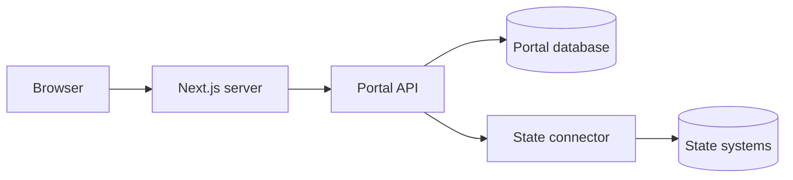

# Data flows

Two questions decide almost everything about how data moves here. Where does a request go, and what is left behind
once it has been answered.

## How a request travels

The browser never calls the .NET API directly. Every request to `/api/...` goes to the Next.js server first, which
forwards it on.

Routing every call through one server-side point buys three things:

- **Credentials stay on the server.** The sign-in token exchange happens in .NET, so secrets are never sent to a
  browser.
- **The API is not reachable from outside.** The proxy rejects attempts to escape `/api/`, literal or encoded, so a
  crafted request cannot reach the API's own health or documentation endpoints.
- **Failures are legible.** A timeout becomes a 504 and an unreachable backend becomes a 502, both recorded on a
  trace rather than surfacing as an opaque error.

From there the API loads the connector for the configured state, asks it for the household, and the connector
translates whatever the state's systems return into the portal's own model.

## Read-through, not copied

Household data is used for the request that needed it and then discarded. It never reaches the portal's database.

This is the single most important thing to understand about the system, because it decides what a security review
has to cover. The portal is not a copy of your benefits data with a website in front of it. It is a view onto your
systems, and it holds almost nothing of its own.

## What the portal stores

The portal's own database has 6 tables. This is all of them:

| Table | What it holds |
| --- | --- |
| `Users` | How thoroughly a user has verified their identity. |
| `UserOptIns` | Whether the user agreed to store their email address or date of birth. Storing either is opt-in. |
| `DocVerificationChallenges` | Individual document verification attempts, each with its own lifecycle. |
| `EnrollmentCheckSubmissions` | When a check ran, how many children it covered, and a hash of the IP address. |
| `DeidentifiedChildResults` | Per child: birth year, status, eligibility type, school name. No name, and no full date of birth. |
| `CardReplacementRequests` | Cooldown enforcement. Household and case identifiers are stored as one-way hashes. |

What is absent matters as much as what is there. Children's names, case numbers, benefit amounts, card numbers, and
mailing addresses have no table.

## When something has to persist

A few business rules need to outlive the request, and card replacement is the clearest example. Enforcing a cooldown
means recognising a household on its next visit, which means keeping something that identifies it.

The portal keeps a one-way hash rather than the value itself. It can tell that two requests came from the same
household without being able to read who that household is. The same approach covers the IP address recorded against
an enrollment check.

The rule this follows is worth stating on its own: if the portal only ever needs to *match* a value, it stores a
hash. It stores the real value only when it needs to *read it back*, and the two cases where that applies, an email
address and a date of birth, are both opt-in rather than default.

Enrollment check results are handled the same way. What is kept per child is a birth year rather than a full date of
birth, and no name at all, so the record supports counting and reporting without identifying anyone.

## Where to go next

- [How the connector works](connector.md) covers the last hop, from the API to your systems.
- [Prepare the database](../deploy/database.md) covers creating the schema those 6 tables live in.
- [Compliance](../../compliance/security.md) covers encryption, retention, and the gaps we have not closed.
