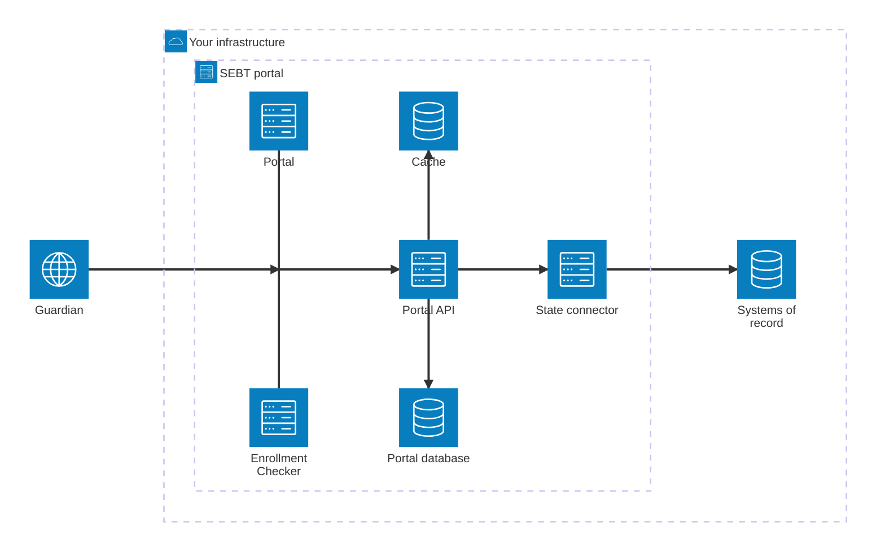
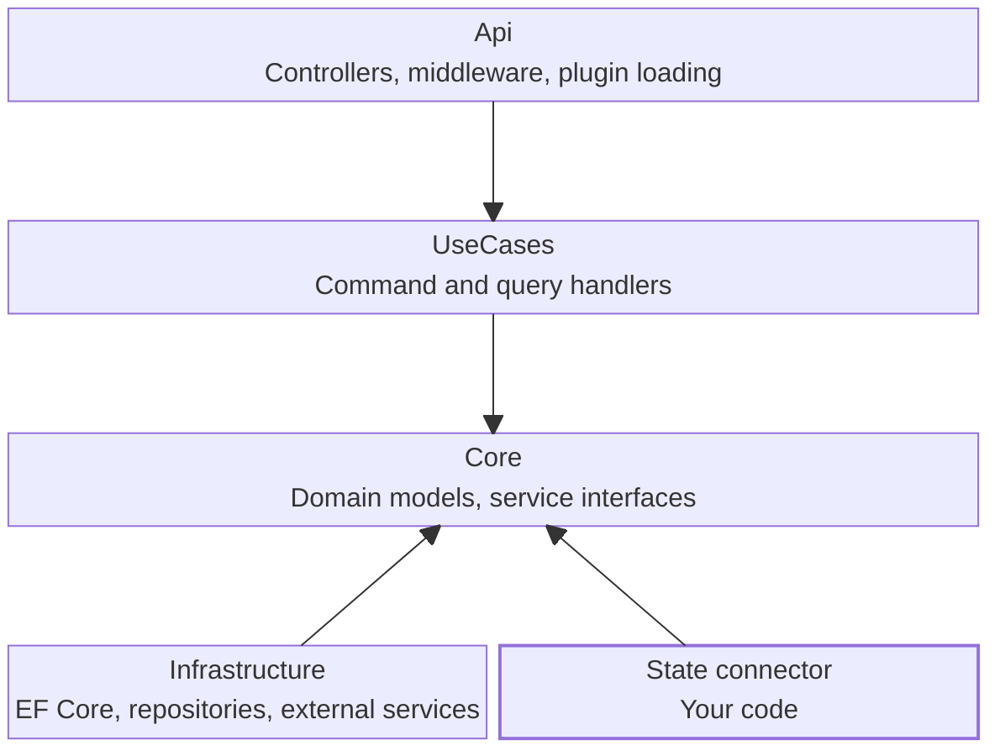

# Overview

The Summer EBT Self-Service Portal lets families manage the Summer EBT (SUN Bucks) benefits their state issues to
their children. The same application runs in every state, and everything a state does differently sits behind one
interface. Colorado and Washington, DC run it today.

## Find your path

Four reasons bring people here. Pick the one that matches yours.

  <a class="cta" href="../plan/index.md">
    
    Run the portal in your state
    The full path from first decision to a deployed portal: what to settle, what to build, and how to ship it.
  </a>
  <a class="cta" href="user-flows.md">
    
    Understand how it works
    What a family does, how a request travels, and what the portal keeps once it has answered.
  </a>
  <a class="cta" href="../local-setup/index.md">
    
    Work on the code
    Get the API, a front end, and a database running on your own machine.
  </a>
  <a class="cta" href="../../compliance/index.md">
    
    Review it
    Security, privacy, accessibility, and licensing, with each claim pointing at where it is implemented.
  </a>

The first path is the one written out in full today. It runs through
[Administration](../plan/index.md) for the decisions, [Development](../local-setup/index.md) for the code,
[Customizing](../content/index.md) for what a family sees, and [Deployment](../deploy/index.md) for shipping it.

## System architecture

Everything the portal runs on sits inside your boundary. Nothing here is hosted by us.

The inner box is what you install. The outer box is everything you already have. That line matters when you plan
the work, because only the inner box is new: the systems of record beyond it keep the interfaces they have today,
and the connector is what reaches across.

  What the colors mean
  
    
    <strong class="legend-title">The person using it</strong>
    A guardian, in a browser. The only thing on the diagram that is not yours.
  
  
    
    <strong class="legend-title">Ours to maintain</strong>
    Code we ship and you adopt. You run it and configure it, but you do not write it.
  
  
    
    <strong class="legend-title">Yours to write</strong>
    The one component your team builds, against a published contract. It is also the only
    thing that touches your systems of record, and it mostly reads.
  
  
    
    <strong class="legend-title">Yours to run</strong>
    A resource rather than code: databases, a cache, your systems of record. The portal
    database counts, because the application defines the schema but the data and the machines are yours.
  

One guardian, two pathways. The **Portal** is the signed-in one: nothing is shown until the portal knows who the
guardian is and how thoroughly they were verified. The **Enrollment Checker** needs no account at all, which is why
it is a separate deployment rather than a page inside the Portal.

| Piece | What it is | Notes |
| --- | --- | --- |
| Portal | Next.js front end for signed-in guardians | Listens on port 3000. Optional if you only want the checker. |
| Enrollment Checker | Next.js front end, no account needed | A separate deployment that shares the API. |
| Portal API | ASP.NET Core on .NET 10 | Listens on 8080 and 8081. Not reachable from outside; the web tier proxies to it. |
| State connector | Your code, against a published contract | Loaded at start-up from a per-state directory. |
| Portal database | SQL Server | 6 tables, none holding household data. Schema applied on start-up. |
| Cache | Redis | Optional. Without it the application falls back to an in-memory cache. |
| Systems of record | Yours | The connector is the only thing that talks to them. |

### The web tier is a tier, not an app

The Portal and the Enrollment Checker are separate deployments that share one API. They are built, released, and
scaled independently, and they answer different questions. The Portal needs a signed-in guardian. The Enrollment
Checker deliberately needs no account. Run one or both; adding the second later is a deployment rather than new
software.

Both also act as a server-side proxy. The browser never reaches the API directly, which is what keeps credentials
off the client and the API off the public network. [Data flows](data-flows.md) covers that path in detail.

### What reaches outside

Every one of these is a choice rather than a given, and only the first row is unavoidable.

| Service | Called by | What it does | Needed when |
| --- | --- | --- | --- |
| Identity provider, or an email sender | API | Signs a family in | Always. Which one depends on how families sign in. |
| Socure | API and browser | Verifies identity | Only when the portal verifies identity itself rather than trusting your sign-in. |
| Smarty | Browser | Suggests and checks a mailing address | Only when you want addresses checked against postal data. |
| Telemetry collector | API and web tier | Receives traces and metrics, forwards them on | Only when you want monitoring. The application starts nothing without one. |
| Analytics | Browser | Measures how families use the portal | Never required. |

[Plan your program](../plan/index.md) covers each of these decisions and what it takes to procure them.

### Inside the API

The API is layered so that the parts holding business rules never depend on the parts holding infrastructure.

Arrows point at what a layer depends on, and the bottom row is the reason the stack is not a simple top-to-bottom
one. `Core` defines the interfaces. `Infrastructure` and your connector implement them, so they depend upward
rather than being depended on. That inversion is what lets a state swap the connector without touching anything
else, and why `Core` and `UseCases` contain no reference to HTTP, SQL, or any vendor. See
[ADR 0002](../../adr/0002-adopt-clean-architecture.md).

## What varies by state

Four things, and everything else is shared.

- **Household data.** The connector, and only the connector. See [How the connector works](connector.md).
- **Wording and translations.** Generated into locale files from a per-state source.
  See [Change user-facing text](../content/index.md).
- **Color, type, and logo.** A per-state design token file.
  See [Change how the portal looks](../branding/index.md).
- **Which features are on.** A per-state configuration overlay and feature flags.

Colorado and Washington, DC exercise every one of these differently and still run the same application. Colorado
reads household data from a live API call and keeps its connector in this repository. Washington, DC reads from a
state-provided database seeded on a schedule and keeps its connector in a repository of its own. Colorado trusts an
assurance level asserted by its own sign-in; Washington, DC verifies identity in the portal itself. Colorado deploys
containers, and Washington, DC deploys to IIS on Windows Server.

None of that is a property of the software. Each one is a decision, and
[Plan your program](../plan/index.md) is where you make yours.

## In this section

- [User flows](user-flows.md) covers what a family does in each front end.
- [Data flows](data-flows.md) follows a request from the browser to a state's systems and back.
- [How the connector works](connector.md) covers the contract and how the portal loads it.
