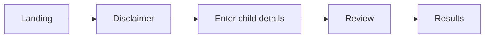
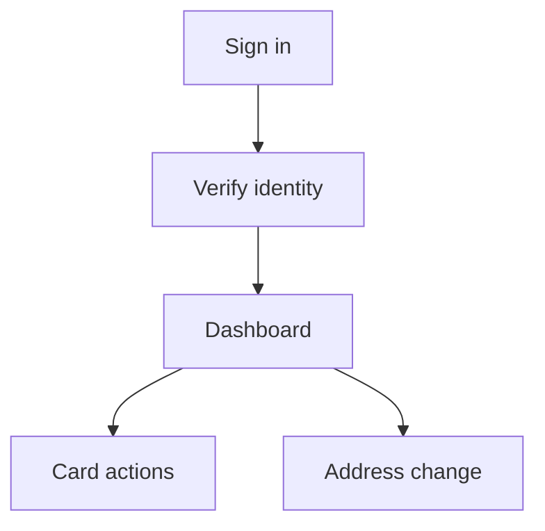

# User flows

The two front ends serve different people at different moments. The Enrollment Checker answers a question for
someone who may not have an account and may not need one. The Portal serves a guardian who has signed in and wants
to act on their own household's benefits.

## The Enrollment Checker

A family arrives wanting one answer: is my child already signed up? The whole flow exists to answer that without an
account, because requiring one would turn a 2 minute question into a sign-up.

1. **Landing.** Explains what the check does and what it does not do.
2. **Disclaimer.** Sets expectations before any personal detail is entered.
3. **Enter child details.** The family supplies what the state needs to match a child, which varies by state.
4. **Review.** A chance to correct a typo before anything is submitted.
5. **Results.** Enrolled, not enrolled, or not determinable.

Two screens sit outside that path. **Closed** appears when the program is not currently accepting checks, and
**Outage** appears when the checker has been switched off deliberately or on a schedule.

Three things shape this flow per state:

- **Whether it runs at all.** The `enable_enrollment` flag. Colorado runs the checker. Washington, DC does not.
- **Whether income screening is included.** Washington, DC configures household income thresholds that the check can
  take into account.
- **Whether a banner or an outage page is showing.** Both are flags, so a state can put up a maintenance notice
  without a release.

The endpoint behind this is public and unauthenticated, so it is rate limited. The checker also polls the API for
its own feature state at runtime rather than reading it from a build, which is what lets a state toggle the banner
or the outage page without redeploying the checker.

## The Portal

The Portal assumes the opposite: the person needs to be known before anything is shown.

**Sign in** takes one of two shapes depending on the state. Either the family is sent to the state's own single
sign-on and returns through a callback, or they enter an email address and then a one-time passcode sent to it.

**Verify identity** is separate from signing in, and this is the distinction worth holding onto. Signing in proves
someone holds an account. It does not prove they are the person whose benefit data sits behind it. Depending on the
state, the assurance level either arrives with the sign-in or the portal establishes it directly, which can include
a document verification step. A family that cannot reach the required level is taken to an off-boarding page that
explains what to do instead, rather than into a dead end.

**The dashboard** is the landing point once both are satisfied. From there:

- **Card actions.** Seeing card details, activating a card, and requesting a replacement. A replacement runs through
  a confirmation step, and requests are subject to a cooldown so a family cannot order several by accident.
- **Address change.** The family enters an address, and if address checking is switched on they are offered a
  suggested corrected version or told the address could not be found. A change of address can also prompt a
  replacement card, so the two flows meet.

What appears on these screens is not fixed. Case numbers, application numbers, and the last four digits of a card
are each behind a flag, because not every state's systems hold them. See [Plan your program](../plan/index.md).

## What both have in common

Every screen in both applications is built from the same component set, targets WCAG 2.1 AA, and reads its wording
from generated locale files rather than from hardcoded strings. A state changes what a family reads without touching
either flow. See [Change user-facing text](../content/index.md).
