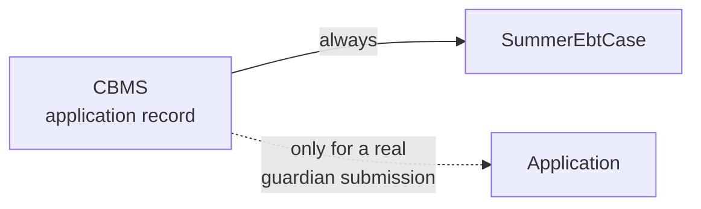
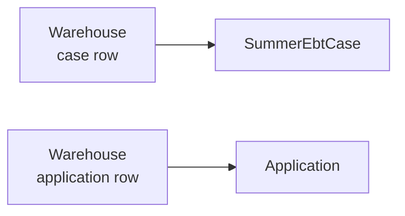
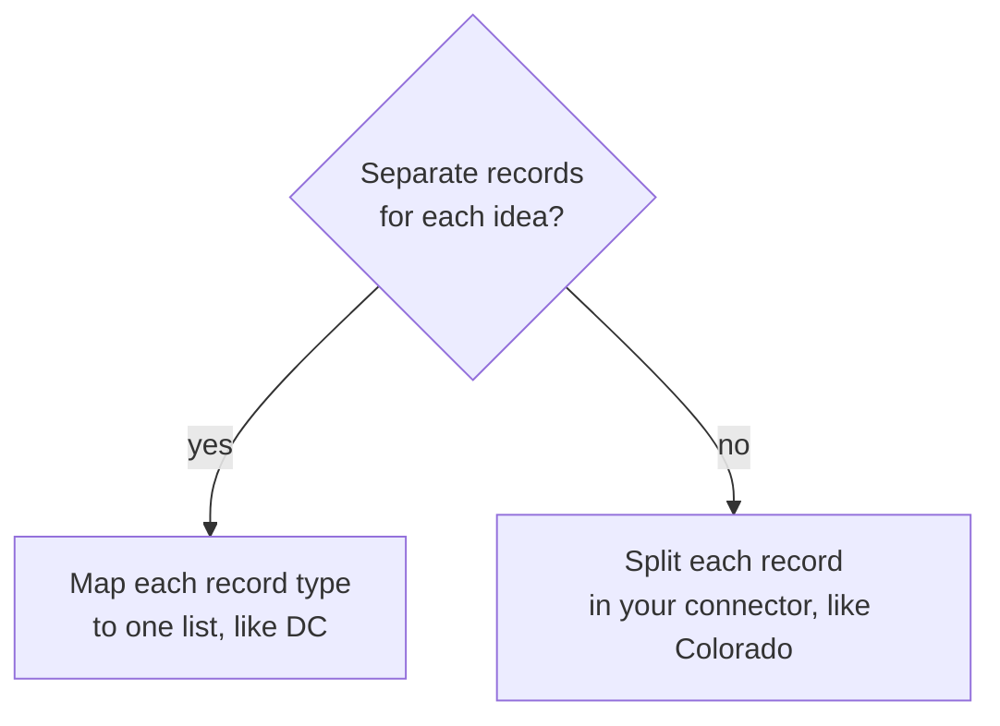

# Data mapping

Your connector returns `HouseholdData`. Convert the data of your state to this type at your boundary. Then no
state-specific shape reaches the inner layers of the portal.

```csharp
public class HouseholdData
{
    public string Email { get; set; }
    public string? Phone { get; set; }
    public List<SummerEbtCase> SummerEbtCases { get; set; }
    public List<Application> Applications { get; set; }
    public Address? AddressOnFile { get; set; }
    public UserProfile? UserProfile { get; set; }
    public BenefitIssuanceType BenefitIssuanceType { get; set; }
}
```

## Cases are not applications

This difference is the most common cause of a mapping defect. The two types are separate.

| Type | Meaning | How many |
| --- | --- | --- |
| `SummerEbtCase` | One child with issued benefits | Most children have one. |
| `Application` | One request that a guardian submitted for one or more children | Few children have one. |

Most cases are auto-issued. They have no application behind them. A case can link to an application, but usually it
does not.

## Each state has a different source shape

The canonical model always has 2 lists. Your source data has 1 shape or 2 shapes. Select your state to see the
conversion.

# [Colorado](#tab/co)

CBMS represents everything as an application. One record holds the child data and the benefit data together. Your
connector splits each record into the 2 canonical lists.



The solid arrow is unconditional. Every record gives one case. The broken arrow is conditional. State-specific
attributes on the record tell you whether a guardian submitted an application.

# [DC](#tab/dc)

The warehouse separates the 2 ideas already. Each row type maps to one list, so the conversion is close to direct.



No split is necessary. Read each row type and add it to the list that corresponds to it.

# [A new state](#tab/new)

Answer one question first: does your backend store cases and applications as separate records?



The portal never splits records for you. If your backend combines the 2 ideas, your mapping layer must separate
them.

***

## Rules for the mapping layer

1. Put each conversion in your connector. Do not return a state-specific type.
2. Set `BenefitIssuanceType` for each household. The portal uses it to choose the text that families see. A value
   of `Unknown` is the default, and it gives families the least specific wording.
3. Apply the `piiVisibility` and `identityAssuranceLevel` arguments to each field that you return. Return `null`
   for `AddressOnFile` when the level of the caller does not permit an address. The portal passes the level that
   the user reached. Your connector decides which fields that level permits, so read
   [ADR 0027](../../adr/0027-unified-id-proofing-requirements.md) for the policy and check how Colorado applies it.
4. Give one `SummerEbtCase` for each child with issued benefits.
5. Give one `Application` for each real guardian submission, and no more.

## Related decisions

- [ADR 0025](../../adr/0025-vendor-agnostic-data-layer.md) explains the privacy-aware data layer.
- [ADR 0029](../../adr/0029-co-loaded-error-code-taxonomy.md) gives the closed set of error codes.
- [ADR 0020](../../adr/0020-core-ports-for-state-connector-access.md) shows how the inner layers reach your
  connector.
