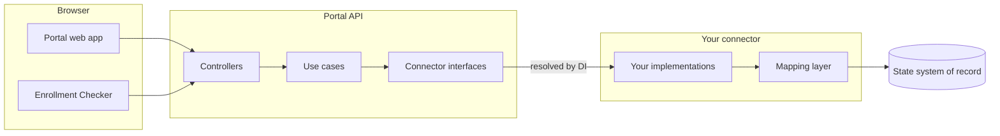

# Build a state connector

A state connector is a .NET assembly that connects the portal to the systems of record of one state. The portal has
no state-specific logic. It loads a connector at start-up and calls it for household data, card replacements, address
updates, and enrollment checks.

The portal knows only the interfaces. Your connector supplies the implementations. The mapping layer converts the
data of your state into the canonical model of the portal.

## Where to start

| Your task | Read |
| --- | --- |
| Make a connector load for the first time | [Quickstart](quickstart.md) |
| Find what you must implement | [The contract](contract.md) |
| Convert state data to the portal model | [Data mapping](data-mapping.md) |
| Repair a connector that does not load or behaves incorrectly | [Troubleshooting](troubleshooting.md) |

## Two connectors to read

Two connectors exist today. Both satisfy the same contract, but they share no other code.

| State | Location | Backend |
| --- | --- | --- |
| Colorado | [`apps/connectors/co/`](https://github.com/codeforamerica/sebt-self-service-portal/tree/main/apps/connectors/co) | CBMS, over HTTP |
| DC | [`sebt-self-service-portal-dc-connector`](https://github.com/codeforamerica/sebt-self-service-portal-dc-connector) | SQL warehouse |

Colorado is in this repository. Read it first, because you can build and run it.

## Background

Two decision records explain why the system has this shape:

- [ADR 0023](../../adr/0023-multi-state-plugin-approach.md) gives the reason for the connector architecture.
- [ADR 0011](../../adr/0011-plugin-di-bridge.md) tells why the project replaced MEF composition with DI.
