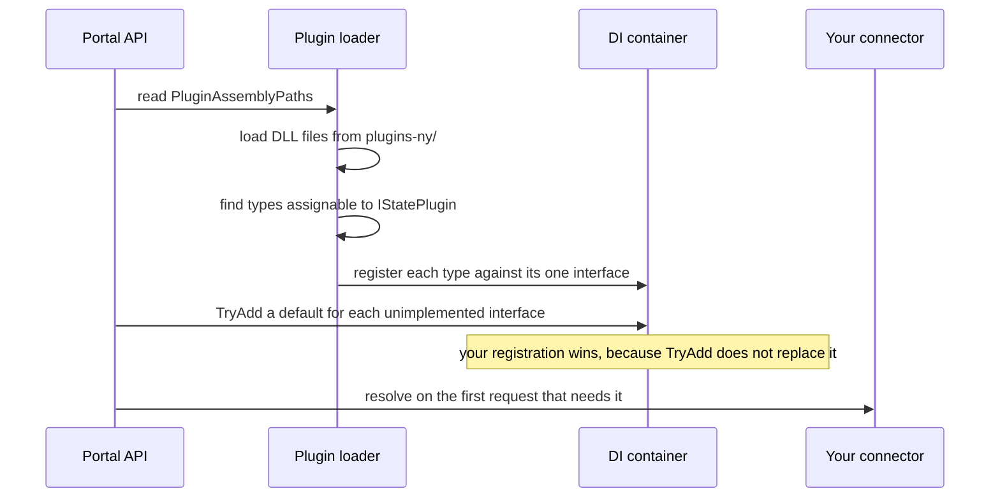

# Quickstart

This page tells you how to make a connector that the portal loads. Use New York as the example state. At the end,
the portal loads your assembly and registers your class. Your connector returns no state data yet.

## What the portal needs

No interface is mandatory for start-up. The portal registers a default for 6 of the 7 interfaces. If the plugin
directory holds no matching types, the loader writes a warning and the portal runs on defaults only.

Start with `IStateMetadataService` anyway, for 2 reasons. It is the only interface without a default, and both
existing connectors implement it. It gives you the smallest class that proves your build and load path.

> [!NOTE]
> Nothing in the portal calls `IStateMetadataService` today. The state name that it returns reaches no page and no
> endpoint. Step 10 below verifies the load through the log instead. See
> [Troubleshooting](troubleshooting.md#known-contract-problems).

## Procedure

1. Make a project at `apps/connectors/ny/src/SEBT.Portal.StatePlugins.NY/`.

2. Add a `ProjectReference` to the connector contract:

   ```xml
   <ProjectReference Include="../../../state/src/SEBT.Portal.StatesPlugins.Interfaces/SEBT.Portal.StatesPlugins.Interfaces.csproj" />
   ```

3. Add the project to `SEBT.slnx`.

4. Write one class that implements `IStateMetadataService`:

   ```csharp
   using SEBT.Portal.StatesPlugins.Interfaces;
   using SEBT.Portal.StatesPlugins.Interfaces.Data;

   namespace SEBT.Portal.StatePlugins.NY;

   public class NewYorkStateMetadataService : IStateMetadataService
   {
       public Task<StateMetadata> GetStateMetadata() =>
           Task.FromResult(new StateMetadata { Name = "New York" });
   }
   ```

5. Add this target to your project file. It copies the built DLL files into the plugin directory of the API after
   each build. The path is relative to your project file, so count the parent directories again if your project is
   at a different depth.

   ```xml
   <Target Name="CopyPlugins" AfterTargets="Build" Condition="'$(CopyPlugins)' != 'false'">
     <PropertyGroup>
       <_PluginDestDir Condition="'$(PluginDestDir)' != ''">$(PluginDestDir)</_PluginDestDir>
       <_PluginDestDir Condition="'$(_PluginDestDir)' == ''">$([System.IO.Path]::GetFullPath('$(MSBuildThisFileDirectory)../../../../portal/src/SEBT.Portal.Api/plugins-ny'))</_PluginDestDir>
     </PropertyGroup>
     <ItemGroup>
       <_PluginDlls Include="$(OutputPath)*.dll" />
     </ItemGroup>
     <MakeDir Directories="$(_PluginDestDir)" Condition="!Exists('$(_PluginDestDir)')" />
     <Copy SourceFiles="@(_PluginDlls)" DestinationFolder="$(_PluginDestDir)" SkipUnchangedFiles="true" />
   </Target>
   ```

6. Make the file `appsettings.ny.example.json` in the API project. Give it the plugin path and the log level that
   step 10 needs:

   ```json
   {
     "PluginAssemblyPaths": ["plugins-ny"],
     "Serilog": { "MinimumLevel": { "Default": "Debug" } }
   }
   ```

7. Copy that file to `appsettings.ny.json`. Do not commit the copy. State overlays hold credentials.

8. Build the solution:

   ```bash
   dotnet build SEBT.slnx
   ```

9. Confirm that the DLL files arrived:

   ```bash
   ls apps/portal/src/SEBT.Portal.Api/plugins-ny/
   ```

10. Start the API and read the log:

    ```bash
    STATE=ny pnpm api:dev
    ```

    Find this line in the output:

    ```text
    Discovered plugin type: SEBT.Portal.StatePlugins.NY.NewYorkStateMetadataService
    ```

    That line proves the portal found and registered your class. If the line is absent, go to
    [Troubleshooting](troubleshooting.md).

## What happens at start-up



The loader resolves the plugin paths against the content root of the API. This makes `dotnet run` and `dotnet watch`
work without a copy step into the binary directory.

> [!IMPORTANT]
> The portal loads assemblies at start-up. Restart the API after each connector build. A rebuild alone does not
> change the process that runs.

## Next: make the connector return real data

Work in this order. Each step gives the portal a capability that families can see.

| Order | Implement | Result in the portal | Reference |
| --- | --- | --- | --- |
| 1 | `ISummerEbtCaseService` | The dashboard lists children, benefits, and card status. | [Contract](contract.md#isummerebtcaseservice), [Data mapping](data-mapping.md) |
| 2 | `IStateHealthCheckService` | Health output reports your state backend. | [Contract](contract.md#rules-for-each-class) |
| 3 | `IEnrollmentCheckService` | The Enrollment Checker answers without a login. | [Contract](contract.md#the-interfaces) |
| 4 | `IAddressUpdateService` | A guardian can change the mailing address. | [Contract](contract.md#the-interfaces) |
| 5 | `ICardReplacementService` | A guardian can request a replacement card. | [Contract](contract.md#the-interfaces) |

Implement `ISummerEbtCaseService` first. It is the largest interface, and every other capability is of little use
while the dashboard is empty. Read [data mapping](data-mapping.md) before you write it. The conversion from your
state data to `HouseholdData` is the part that goes wrong most often.

Set `UseMockHouseholdData` to `true` while you wait for state credentials. The portal then serves fixtures and
does not call your connector. See [Troubleshooting](troubleshooting.md#development-without-state-credentials).
